# SignBridge Project - Complete Workflow Documentation

## Project Overview
SignBridge is a comprehensive Indian Sign Language platform that provides multiple services including sign language recognition, speech-to-sign conversion, text-to-sign conversion, Braille conversion, and educational course materials. The system uses a modular Flask backend architecture with separate React frontend.

## System Architecture

### High-Level Architecture
```
┌─────────────────┐    ┌─────────────────┐    ┌─────────────────┐
│   Frontend      │    │   Backend       │    │   ML Models     │
│   (React)       │◄──►│   (Flask)       │◄──►│   (YOLO/AI)     │
└─────────────────┘    └─────────────────┘    └─────────────────┘
                               │
                               ▼
                       ┌─────────────────┐
                       │   File Storage  │
                       │   (Videos/Images│
                       └─────────────────┘
```

### Backend Architecture
```
BackEnd/
├── app.py                  # Main Flask application factory
├── config.py               # Configuration management
├── run.py                  # Application entry point
├── blueprints/             # Modular service endpoints
│   ├── text_to_sign.py     # Text-to-sign conversion
│   ├── sign_detection.py   # Real-time sign detection
│   ├── speech_to_sign.py   # Speech-to-sign pipeline
│   ├── braille_conversion.py # Text-to-Braille conversion
│   └── course_material.py  # Educational content management
├── shared/                 # Shared utilities
├── utils/                  # Helper functions
├── SignDetectionPipeline/  # Sign detection resources
├── TextToSignPipeline/     # Text-to-sign resources
├── uploads/                # User uploads
├── outputs/                # Generated content
└── static/                 # Static files
```

## Core Workflows

### 1. Sign Language Detection Workflow

#### 1.1 Real-time Detection Flow
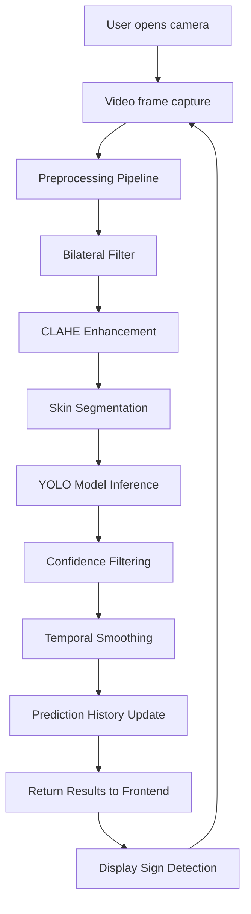

#### 1.2 Image Upload Detection Flow
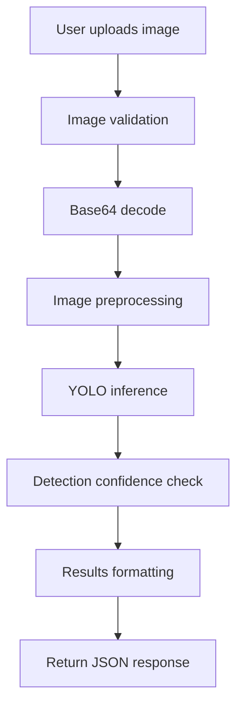

#### 1.3 Processing Pipeline Details
- **Preprocessing Steps:**
  1. Bilateral filter for noise reduction (preserves edges)
  2. CLAHE (Contrast Limited Adaptive Histogram Equalization)
  3. HSV color space conversion
  4. Skin segmentation using HSV ranges
  5. Morphological operations (opening/closing)

- **YOLO Model Features:**
  - Primary: Fine-tuned model (`fine_tuned.pt`)
  - Fallback: YOLOv8n (`yolov8n.pt`)
  - Classes: A-Z letters, 0-9 numbers (35 classes total)
  - Confidence threshold: 0.5-0.6 (configurable)

- **Temporal Smoothing:**
  - History buffer of 5 frames
  - Majority voting for stable predictions
  - Reduces flickering in real-time detection

### 2. Text-to-Sign Conversion Workflow

#### 2.1 Text Processing Flow
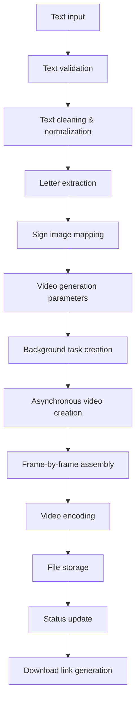

#### 2.2 Video Generation Process
```mermaid
flowchart TD
    A[Start video generation] --> B[Task status: Processing]
    B --> C[Load sign images]
    C --> D[For each letter]
    D --> E[Create video frame]
    E --> F[Apply transitions]
    F --> G[Add to frame sequence]
    G --> H{More letters?}
    H -->|Yes| D
    H -->|No| I[Combine frames]
    I --> J[Video encoding (MP4)]
    J --> K[Save to output directory]
    K --> L[Task status: Completed]
```

#### 2.3 Text Summarization Integration
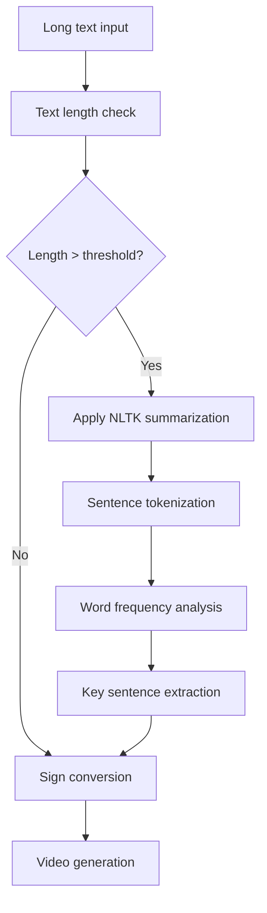

### 3. Speech-to-Sign Conversion Workflow

#### 3.1 Audio Processing Flow
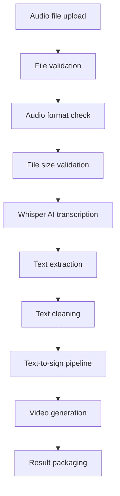

#### 3.2 Whisper Integration
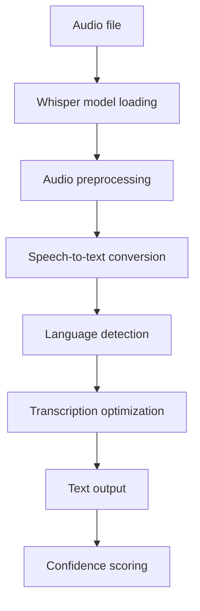

### 4. Braille Conversion Workflow

#### 4.1 Text-to-Braille Flow
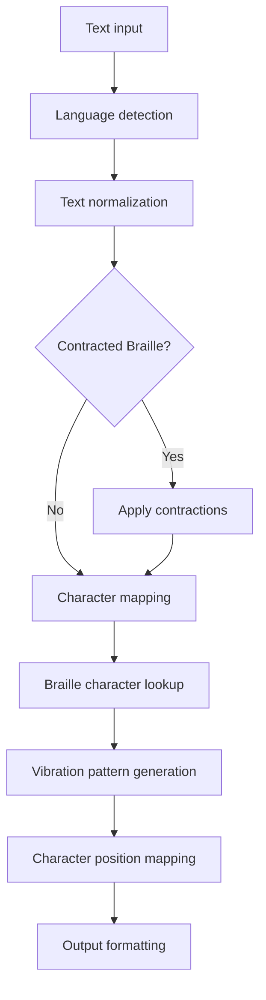

#### 4.2 Braille Features
- **Grade 1 Braille:** Basic character mapping (A-Z, 0-9, punctuation)
- **Grade 2 Braille:** Contracted forms for common words
- **Vibration Patterns:** Haptic feedback simulation
- **Multi-language Support:** English, Spanish, French, German

### 5. Course Material Management Workflow

#### 5.1 Content Management Flow
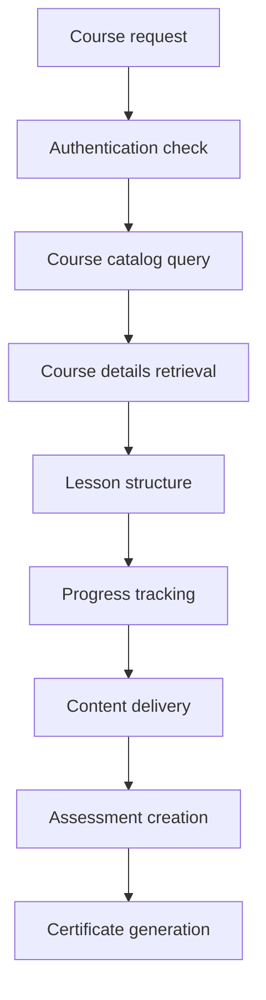

#### 5.2 Learning Path
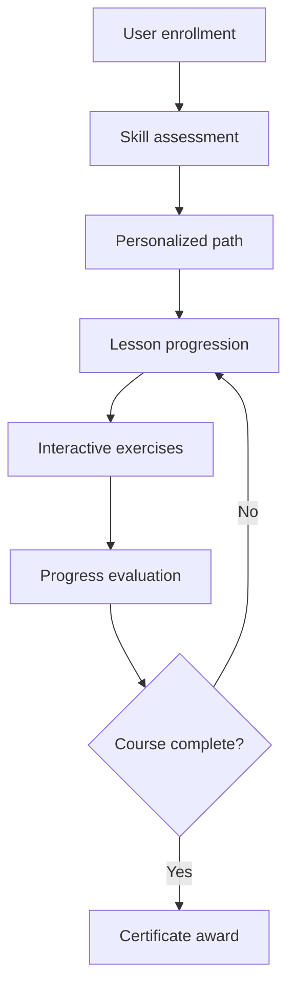

## API Endpoints Structure

### Text-to-Sign Service (`/api/v1/text-to-sign/`)
- `POST /convert` - Start text-to-sign conversion
- `GET /status/{task_id}` - Check conversion progress
- `GET /download/{task_id}` - Download generated video
- `GET /available-letters` - Get available sign letters
- `POST /quiz/start` - Start learning quiz
- `POST /quiz/answer` - Submit quiz answer
- `GET /health` - Service health check

### Sign Detection Service (`/api/v1/sign-detection/`)
- `POST /detect` - Detect signs in uploaded image
- `POST /detect-realtime` - Real-time detection endpoint
- `GET /model/info` - YOLO model information
- `POST /reset-history` - Reset prediction history
- `GET /configuration` - Get detection settings
- `GET /health` - Service health check

### Speech-to-Sign Service (`/api/v1/speech-to-sign/`)
- `POST /convert` - Convert audio to sign video
- `GET /status/{task_id}` - Check conversion progress
- `GET /download/{task_id}` - Download result
- `GET /supported-formats` - Get supported audio formats
- `GET /health` - Service health check

### Braille Conversion Service (`/api/v1/braille/`)
- `POST /convert` - Convert text to Braille
- `POST /vibration-pattern` - Generate haptic patterns
- `GET /languages` - Get supported languages
- `POST /reverse` - Braille to text conversion
- `GET /health` - Service health check

### Course Material Service (`/api/v1/courses/`)
- `GET /catalog` - Get course catalog
- `GET /course/{id}` - Get course details
- `GET /lessons/{course_id}` - Get course lessons
- `POST /enroll` - Enroll in course
- `GET /progress/{user_id}` - Get learning progress
- `POST /assessment` - Submit assessment
- `GET /certificate/{course_id}` - Generate certificate

## Data Flow Patterns

### 1. Synchronous Processing
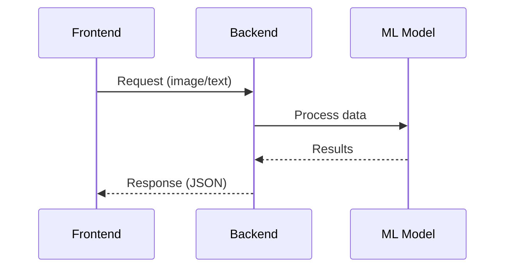

### 2. Asynchronous Processing
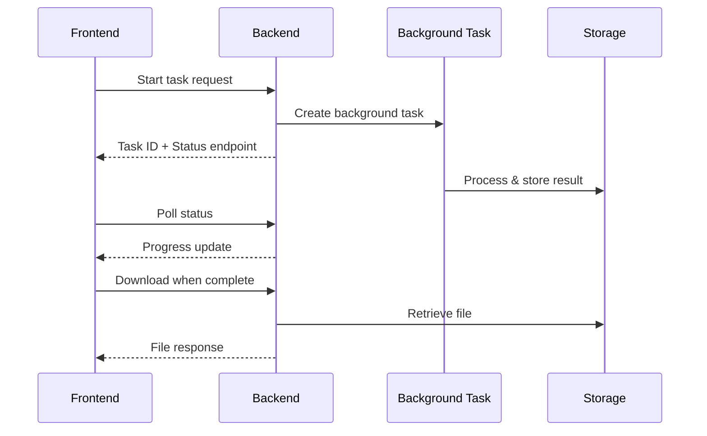

### 3. Real-time Streaming
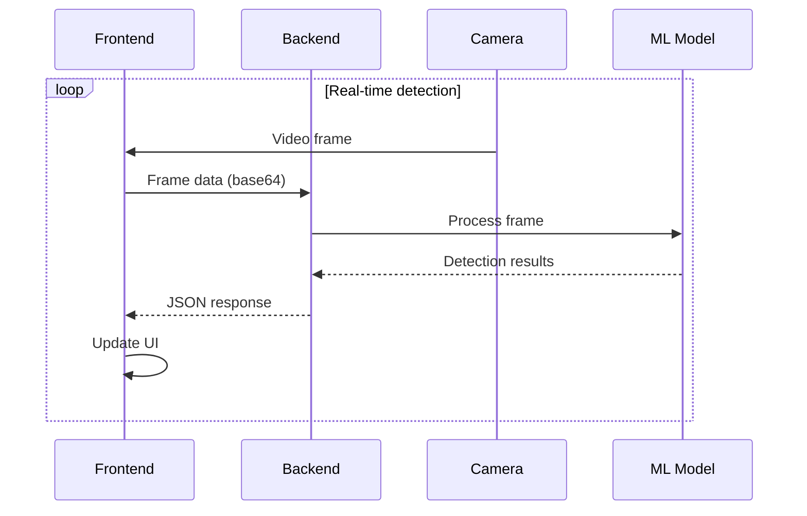

## Error Handling & Recovery

### 1. Model Loading Failures
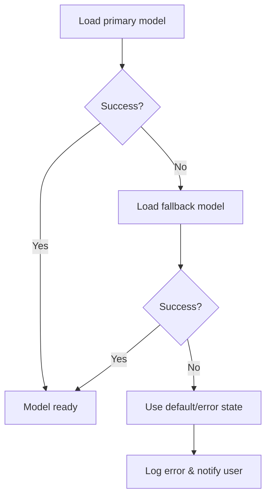

### 2. File Processing Errors
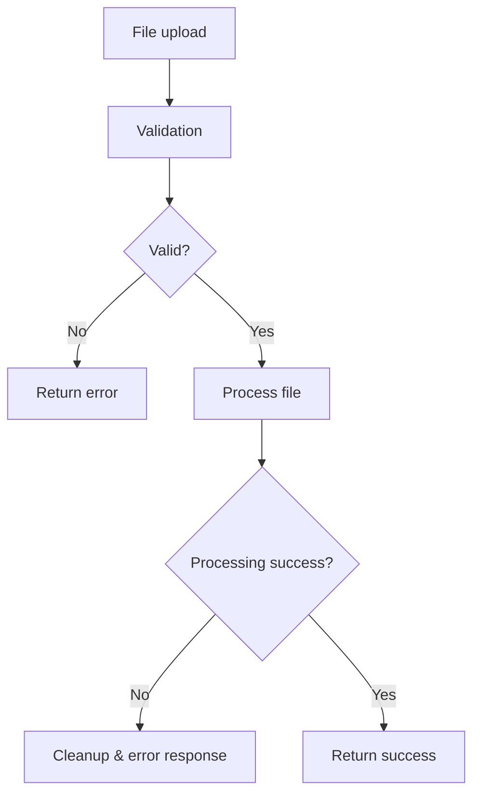

## Performance Optimizations

### 1. Caching Strategy
- **Model Caching:** YOLO models loaded once and reused
- **Image Caching:** Sign images cached in memory
- **Result Caching:** Recent detection results cached
- **Static File Caching:** Course materials and images

### 2. Asynchronous Operations
- **Background Tasks:** Video generation runs in background
- **Thread Pool:** Multiple concurrent processing
- **Queue Management:** Task prioritization and load balancing

### 3. Resource Management
- **Memory Management:** Proper cleanup of large objects
- **File Cleanup:** Automatic deletion of temporary files
- **Connection Pooling:** Database and external service connections

## Security Measures

### 1. Input Validation
- File type and size validation
- Text input sanitization
- Image format verification
- Audio format validation

### 2. Access Control
- CORS configuration for frontend origins
- API key authentication (where needed)
- Rate limiting implementation
- Session management

### 3. Data Protection
- Secure file storage
- Temporary file cleanup
- Privacy-compliant logging
- User data anonymization

## Deployment Architecture

### 1. Development Environment
```
Frontend (React) ← → Backend (Flask) ← → ML Models (Local)
     :3000              :5000            (GPU/CPU)
```

### 2. Production Environment
```
Load Balancer → Frontend (Static) → Backend (Containerized) → ML Models (GPU)
                                         ↓
                                   File Storage (S3/Local)
                                         ↓
                                   Database (Optional)
```

## Monitoring & Logging

### 1. Application Logging
- Request/response logging
- Error tracking and alerting
- Performance metrics
- User activity analytics

### 2. System Monitoring
- Resource utilization (CPU, Memory, GPU)
- Model inference times
- API response times
- File storage usage

## Future Enhancements

### 1. Planned Features
- Real-time collaborative learning
- Advanced gesture recognition
- Multi-language sign support
- AR/VR integration
- Mobile application

### 2. Technical Improvements
- Model optimization for edge devices
- Enhanced preprocessing algorithms
- Better temporal consistency
- Improved user experience
- Scalability enhancements

## Testing Strategy

### 1. Unit Testing
- Individual component testing
- ML model accuracy testing
- API endpoint validation
- Data processing verification

### 2. Integration Testing
- End-to-end workflow testing
- Frontend-backend integration
- Cross-browser compatibility
- Performance benchmarking

### 3. User Acceptance Testing
- Accessibility compliance
- User experience validation
- Educational effectiveness
- Real-world usage scenarios

This workflow documentation provides a comprehensive overview of the SignBridge system architecture, data flow, and operational procedures, suitable for generating detailed flowcharts and system diagrams.